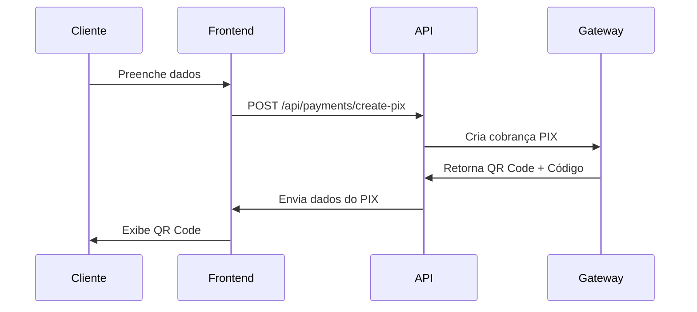
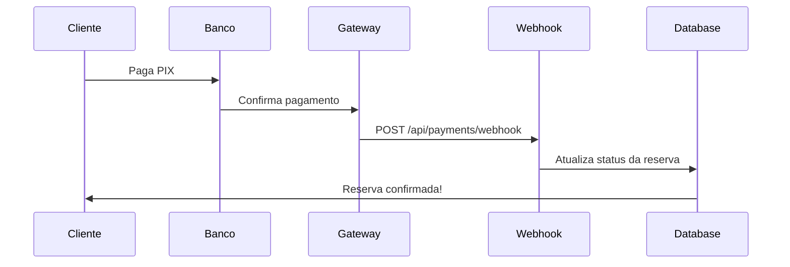

# Integração de Pagamento PIX - Guia de Configuração

## 📋 Visão Geral

Este sistema suporta integração com gateways de pagamento brasileiros para gerar códigos PIX **reais e válidos**. Atualmente suportamos:

- **Asaas** (antiga AbatePay) ⭐ Recomendado
- **Mercado Pago**

## 🚀 Passo a Passo - Asaas (Recomendado)

### 1. Criar Conta no Asaas

1. Acesse: https://www.asaas.com
2. Crie uma conta gratuita
3. Complete o cadastro da sua empresa

### 2. Obter Chave de API

1. Faça login no painel Asaas
2. Vá em **Configurações** → **Integrações** → **API**
3. Ou acesse direto: https://www.asaas.com/config/api
4. Copie sua **API Key** (ela começa com `$aact_`)

⚠️ **IMPORTANTE**: Use a chave de **produção** quando for colocar no ar!

### 3. Configurar Webhook

1. No painel Asaas, vá em **Configurações** → **Webhook**
2. Ou acesse: https://www.asaas.com/config/webhook
3. Configure a URL do webhook: `https://seudominio.com/api/payments/webhook`
4. Marque os eventos:
   - ✅ `PAYMENT_RECEIVED`
   - ✅ `PAYMENT_CONFIRMED`

### 4. Configurar Variáveis de Ambiente

Crie um arquivo `.env.local` na raiz do projeto:

```bash
# Gateway de Pagamento
PAYMENT_GATEWAY=asaas

# Asaas API Key
ASAAS_API_KEY=$aact_SUA_CHAVE_AQUI

# URL do Webhook (após deploy)
NEXT_PUBLIC_WEBHOOK_URL=https://seudominio.com/api/payments/webhook
```

### 5. Testar em Ambiente Sandbox

O Asaas possui um ambiente de testes:

```bash
# Para testes, use esta chave
ASAAS_API_KEY=$aact_YTU5YTE0M2M2N2I4MTliNzk0YTI5N2U5MzdjNWZmNDQ6OjAwMDAwMDAwMDAwMDAwMDAwMDA6OiRhYWNoXzAwMDAwMDAwLTAwMDAtMDAwMC0wMDAwLTAwMDAwMDAwMDAwMA==
```

Para pagar PIX de teste:
1. Use o app do Asaas no celular
2. Ou acesse: https://sandbox.asaas.com/payment/pixQrCode/idc_test

## 💳 Alternativa - Mercado Pago

### 1. Criar Conta no Mercado Pago

1. Acesse: https://www.mercadopago.com.br
2. Crie uma conta de vendedor

### 2. Obter Access Token

1. Acesse o painel de desenvolvedores: https://www.mercadopago.com.br/developers/panel
2. Vá em **Credenciais** → **Credenciais de produção**
3. Copie o **Access Token**

### 3. Configurar Webhook

1. No painel, vá em **Webhooks**
2. Adicione: `https://seudominio.com/api/payments/webhook`
3. Selecione o evento: `payment`

### 4. Variáveis de Ambiente

```bash
# Gateway de Pagamento
PAYMENT_GATEWAY=mercadopago

# Mercado Pago Access Token
MERCADOPAGO_ACCESS_TOKEN=APP_USR-SEU_TOKEN_AQUI

# Webhook
NEXT_PUBLIC_WEBHOOK_URL=https://seudominio.com/api/payments/webhook
```

## 🔧 Fluxo de Funcionamento

### Geração do PIX



### Confirmação de Pagamento



## 📊 Estrutura de Dados

### Tabela de Reservas

Adicione estes campos na tabela `reservations`:

```sql
ALTER TABLE reservations 
ADD COLUMN payment_status VARCHAR(20) DEFAULT 'pending',
ADD COLUMN payment_id VARCHAR(100),
ADD COLUMN payment_date TIMESTAMP,
ADD COLUMN pix_code TEXT;

-- Índices para performance
CREATE INDEX idx_payment_status ON reservations(payment_status);
CREATE INDEX idx_payment_id ON reservations(payment_id);
```

## 🧪 Como Testar

### Teste Local (Mock)

Sem configurar variáveis de ambiente, o sistema gera PIX simulado para desenvolvimento.

### Teste com Asaas Sandbox

1. Configure a chave de sandbox no `.env.local`
2. Reinicie o servidor: `npm run dev`
3. Faça uma reserva
4. Use o app Asaas para pagar o PIX de teste

### Teste em Produção

1. Configure as chaves de **produção**
2. Faça deploy da aplicação
3. Configure o webhook no painel do gateway
4. Teste com um pagamento real de baixo valor (R$ 1,00)

## 💰 Taxas dos Gateways

### Asaas
- **PIX**: 1,99% por transação
- **Sem mensalidade** no plano básico
- Receba em **1 dia útil**

### Mercado Pago
- **PIX**: 0,99% por transação
- Receba na **hora** (PIX)

## 🔐 Segurança

### Variáveis de Ambiente

✅ **NUNCA** commite o arquivo `.env.local`  
✅ Use `.env.example` como template  
✅ No servidor de produção, configure as variáveis no painel do host

### Validação de Webhook

Para garantir que o webhook é legítimo, adicione validação:

```typescript
// Em webhook/route.ts
const signature = request.headers.get('asaas-access-token');
if (signature !== process.env.ASAAS_API_KEY) {
    return NextResponse.json({ error: 'Unauthorized' }, { status: 401 });
}
```

## 🐛 Troubleshooting

### PIX não é gerado

1. ✅ Verifique se `ASAAS_API_KEY` está configurada
2. ✅ Verifique se a chave começa com `$aact_`
3. ✅ Veja o console do navegador para erros
4. ✅ Veja os logs do servidor: `npm run dev`

### Webhook não recebe notificação

1. ✅ URL do webhook está configurada no painel?
2. ✅ A URL é acessível publicamente? (use ngrok para testes locais)
3. ✅ Os eventos estão marcados no painel?
4. ✅ Veja os logs de webhook no painel do gateway

### Pagamento não confirma automaticamente

Isso é **NORMAL**! O webhook pode demorar alguns segundos.  
Por isso temos o botão "Já fiz o pagamento" que faz polling.

## 📱 Próximos Passos

Depois de configurar o PIX, você pode:

1. ✅ Enviar confirmação por WhatsApp
2. ✅ Enviar email de confirmação
3. ✅ Adicionar notificações push
4. ✅ Dashboard de pagamentos para admin

## 📞 Suporte

- **Asaas**: https://ajuda.asaas.com
- **Mercado Pago**: https://www.mercadopago.com.br/developers/pt/support

## ⚡ Deploy Rápido

### Vercel

```bash
# Instale a CLI da Vercel
npm i -g vercel

# Deploy
vercel

# Configure as variáveis no painel da Vercel
vercel env add ASAAS_API_KEY
vercel env add PAYMENT_GATEWAY
```

A URL do webhook será:  
`https://seu-projeto.vercel.app/api/payments/webhook`

---

**Desenvolvido com ❤️ para o Gerenciador de Quadras**
